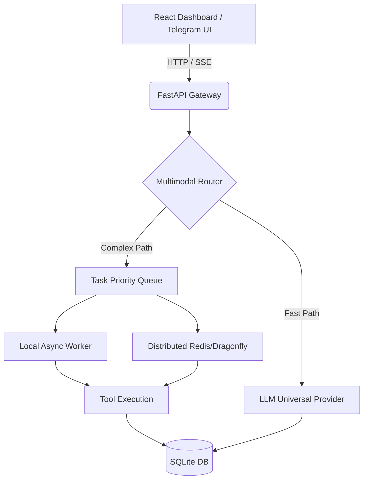

# DreamAgent v10 🚀

> **Autonomous Multi-Model AI Agent Platform** — Universal webhook routing, multi-tier queue tasks, real-time SSE streaming, and local privacy.

[](https://fastapi.tiangolo.com/)
[](https://vitejs.dev/)
[](https://sqlite.org/)

DreamAgent v10 is a production-hardened platform for autonomous AI agents. It intelligently routes conversational queries, executes heavy tasks via background worker queues, processes parallel multi-provider workflows, and provides a polished web interface for controlling everything from Telegram integrations to AI model keys.

---

## ⚡ Quick Start

### Step 1: Install Dependencies
```bash
# 1. Install Python dependencies
pip install -r requirements.txt

# 2. Install Frontend dependencies
cd "frontend of dreamAgent/DreamAgent-v10-UI"
npm install
```

### Step 2: Configure Environment
Copy `.env.example` to `.env` and fill in your keys (e.g. Gemini, Groq, OpenAI). 
*Note: DreamAgent supports a **Bootstrap Fallback Mechanism**! If your primary key hits a rate limit, the system gracefully cycles through your other `.env` providers to guarantee uptime.*

### Step 3: Run the Project
Launch both the backend and frontend simultaneously using the provided batch file:
```bash
./start.bat
```
This will start:
- 🚀 **DreamAgent Server** on `http://localhost:8001`
- 🎨 **DreamAgent Dashboard** on `http://localhost:5000`

---

## 🛠 Project Toolkit

| Script | Purpose |
|---|---|
| `start.bat` | One-click launcher for the entire stack. |
| `clear_db.py` | Automatically sweeps and resets the local `dreamagent.db` SQLite state. |
| `telegram_bot.py` | Background runner for Telegram agent integrations. |
| `test_news_stream.py` | Local debugging suite for SSE generation and task routing. |

---

## 🏗 Architecture & Stack 



### Key Technical Pillars
1. **Universal LLM Provider**: Automatically interfaces with Anthropic, OpenAI, Meta, Gemini, Groq, or Local Ollama using a seamless interface.
2. **Hybrid Queues**: Uses lightweight `asyncio` queues in Windows environments, automatically upgrading to Redis/Dragonfly in high-load distributed deployments.
3. **Optimistic UI / Real-time Sync**: The React UI uses Server-Sent Events (SSE) combined with continuous database synchronization to ensure chat histories never flicker or ghost.

---

## 🔑 Key Features
* **Universal Telegram/Discord Integration**: Central webhook endpoints and local polling integrations via the UI.
* **Persistent Memory**: Your agents retain user preferences across runs and restarts.
* **Advanced Monitoring**: A fully-fledged GUI dashboard tracks total tokens, running tasks, worker failures, and agent health (`/api/v1/stats`).
* **Zero Hardcoding**: 100% portable repository structure.

---

## ⚠️ Security Notice

**Never commit your `.env` or `.db` files!**
This repo is configured with a strict `.gitignore`. If you are uploading this to GitHub, always use terminal Git `git push` or GitHub Desktop instead of the browser's drag-and-drop feature to ensure your secrets remain on your hard drive.
