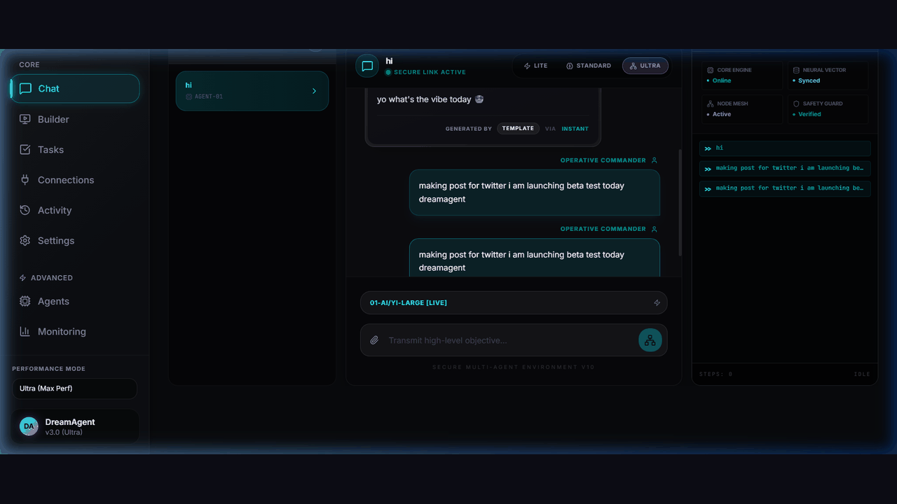
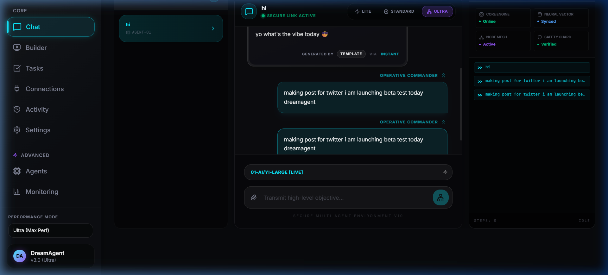
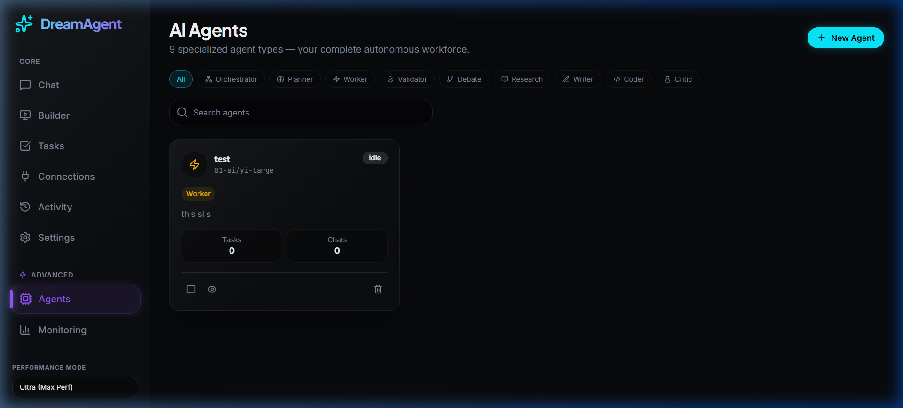
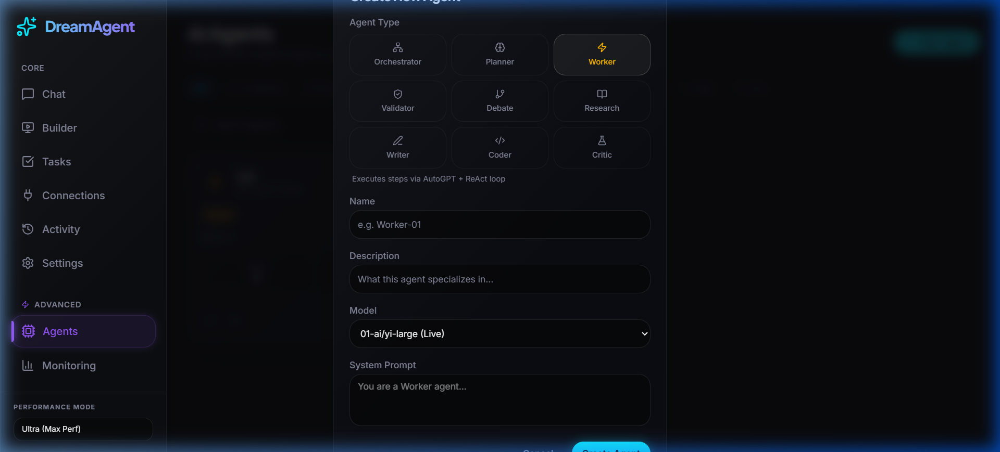
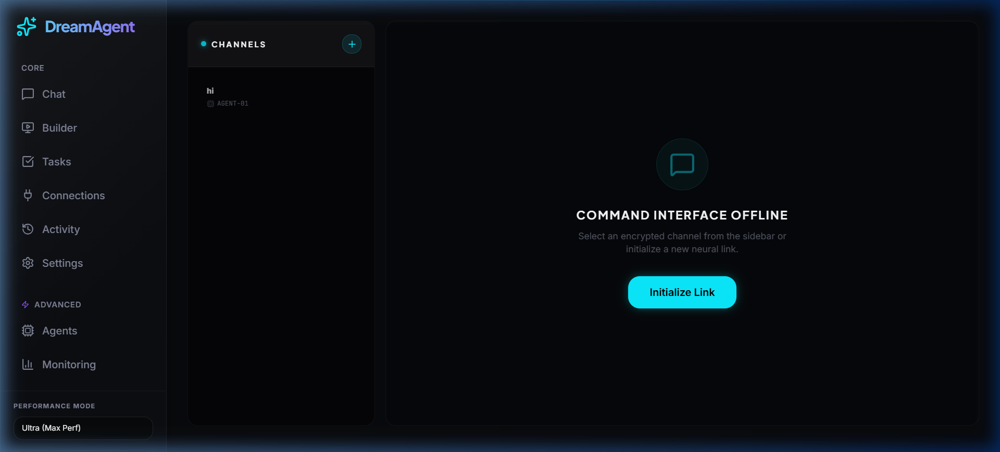
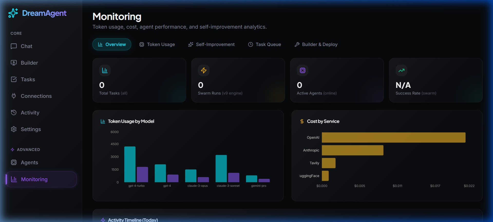
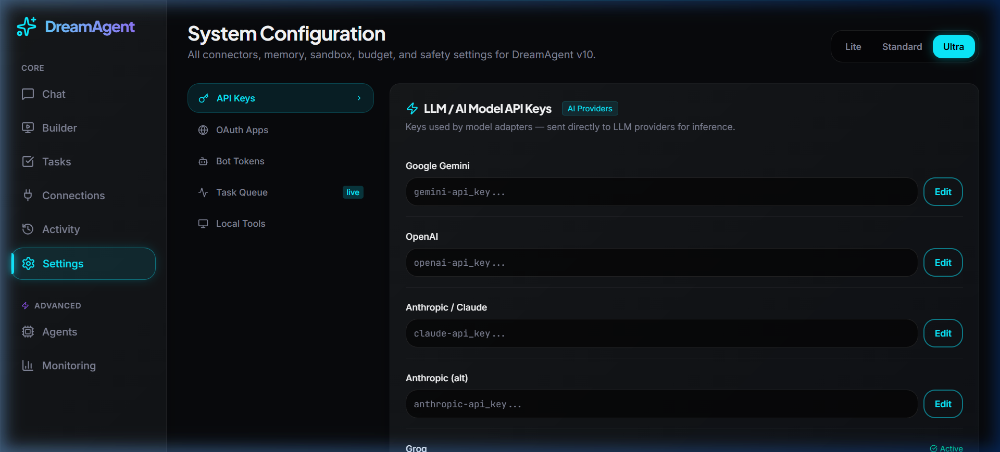
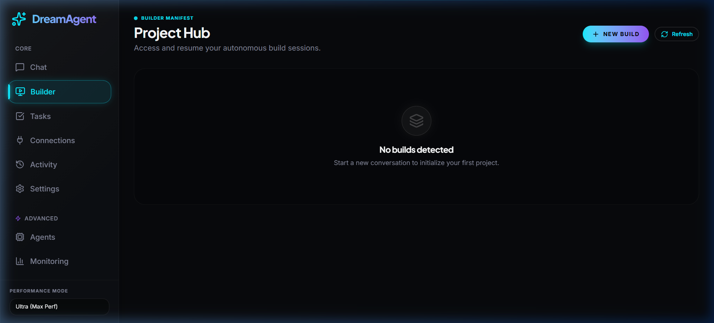
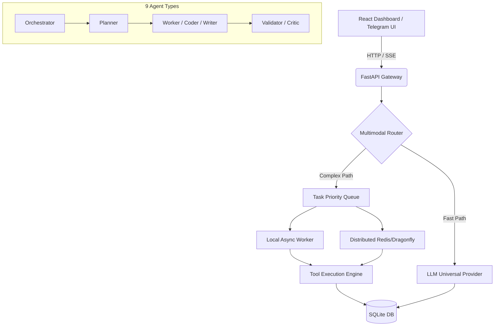

# 🌌 DreamAgent v10

> **Autonomous Multi-Model AI Agent Platform** — 9 specialized agent types, universal webhook routing, multi-tier task queues, real-time SSE streaming, and complete local privacy.

[](https://fastapi.tiangolo.com/)
[](https://vitejs.dev/)
[](https://sqlite.org/)
[](https://python.org)
[](LICENSE)

---

## 🎬 Live Demo



---

## 📸 Screenshots

| Dashboard | AI Agents |
|:---:|:---:|
|  |  |

| Create Agent (9 Types) | Real-Time Chat |
|:---:|:---:|
|  |  |

| Monitoring | Settings |
|:---:|:---:|
|  |  |

| App Builder |
|:---:|
|  |

---

## 🤖 9 Specialized Agent Types

| Type | Icon | Description |
|------|------|-------------|
| **Orchestrator** | 🕸️ Network | Coordinates planners + workers across complex multi-step tasks |
| **Planner** | 🧠 Brain | Decomposes goals into ordered, executable steps |
| **Worker** | ⚡ Zap | Executes steps via AutoGPT + ReAct loop |
| **Validator** | 🛡️ ShieldCheck | Reviews and validates agent outputs for quality |
| **Debate** | 🔀 GitBranch | Ensemble reasoning via multi-perspective debate |
| **Research** | 📖 BookOpen | Gathers data via search, YouTube, and web browsing |
| **Writer** | ✏️ PenLine | Content generation, synthesis, and tone shaping |
| **Coder** | 💻 Code2 | Autonomous dev — reads/writes code, runs tests, git |
| **Critic** | 🔬 FlaskConical | Self-reflection and quality control evaluator |

Each agent runs on your choice of model — GPT-4o, Claude, Gemini, Groq, DeepSeek, Mistral, Ollama, and more.

---

## ⚡ Quick Start

### Step 1: Clone & Install Dependencies
```bash
git clone https://github.com/dreamerdkuroshin/DreamAgent.git
cd DreamAgent

# Install Python dependencies
pip install -r requirements.txt

# Install Frontend dependencies  
cd "frontend of dreamAgent/DreamAgent-v10-UI"
npm install
cd ../..
```

### Step 2: Configure Environment
```bash
cp .env.example .env
# Edit .env with your API keys (Gemini, Groq, OpenAI, etc.)
```

> **💡 Bootstrap Fallback:** If your primary key hits a rate limit, DreamAgent gracefully cycles through your other `.env` providers to guarantee uptime.
(**if u don't do this step then ok u do step 3**) *
### Step 3: Launch
```cmd
start.bat
```
This starts:
- 🚀 **DreamAgent Backend** on `http://localhost:8001`
- 🎨 **DreamAgent Dashboard** on `http://localhost:5000`
after this steps if not start dragonfly then run this command
```
podman-compose.yml
```

### Step 4: Start Chatting with Your Agent

Once the app is running at `http://localhost:5000`, follow these steps to have your first AI conversation:

#### 4a — Add Your API Keys (Settings)
1. Open **Settings** → **API Keys** tab
2. Enter at least one provider key (e.g. OpenAI, Groq, Gemini, Anthropic)
3. Click **Verify** — the key turns ✅ green when valid
4. Save

> 💡 **Tip:** You don't need all providers — even a single free [Groq](https://console.groq.com) key is enough to start.

#### 4b — Create an Agent (Agents Page)
1. Go to **Agents** → click **New Agent**
2. Choose an **Agent Type** (e.g. Worker, Coder, Research)
3. Select the **Model** from your verified providers
4. Give it a name (e.g. `Research-01`) and click **Create Agent**

#### 4c — Chat!
1. Go to the **Chat** page
2. Select your newly created agent from the sidebar
3. Type your message and hit **Send** — responses stream back in real time ⚡

---

## 🏗️ Architecture



---

## 🔑 Key Features

### 🤖 Agent Workforce
- **9 Specialized Types**: Orchestrator, Planner, Worker, Validator, Debate, Research, Writer, Coder, Critic
- **Any Model**: Switch per-agent between GPT-4o, Claude, Gemini, Groq, DeepSeek, Ollama
- **Persistent Memory**: Agents retain context across runs via FAISS + SQLite memory engine

### 🏭 Task Pipeline
- **Multi-Tier Queues**: Simple/Medium/Complex task routing with priority scheduling
- **Hybrid Workers**: Local `asyncio` queues upgrading automatically to Dragonfly/Redis at scale
- **Watchdog Recovery**: Stuck tasks auto-recovered with exponential backoff retries

> 💡 **Where is Dragonfly?** You might notice `start.bat` doesn't run Dragonfly. This is intentional! DreamAgent uses **Self-Healing Fallback** logic. If Dragonfly/Redis isn't detected, it gracefully degrades to using purely local Python `asyncio` memory queues. The platform runs perfectly without Dragonfly for local/personal use. If you want distributed scale, simply spin up the provided `podman-compose.yml`.

### 💬 Real-Time Chat
- **SSE Streaming**: Token-by-token streaming from any provider
- **Optimistic UI**: Zero-flicker persistence via DB sync events
- **Multi-Agent Chat**: Route conversations to specific specialized agents

### 📡 Integrations
- **Telegram Bot**: Full polling + webhook support with memory isolation
- **Gmail / Drive / Calendar**: OAuth-gated Google connectors
- **Tavily Search**: AI-powered web search + news + deep research
- **Supabase**: Auth + Database + Storage out of the box

### 🏗️ App Builder
- **AI-Generated Projects**: Say "Build me an e-commerce site" → get complete React + FastAPI app
- **Live Preview**: View and iterate on generated apps in-browser
- **Version History**: Roll back to any previous build version

### 📊 Monitoring
- **Real-Time Dashboard**: Token usage, task queues, worker health, API costs
- **Agent Health Tracking**: Per-agent task count, conversation count, status
- **System Health Checks**: All backend services, DB, and integrations

---

## 🛠️ Project Toolkit

| Script | Purpose |
|---|---|
| `start.bat` | One-click launcher for the entire stack |
| `clear_db.py` | Sweep and reset local SQLite state |
| `telegram_bot.py` | Telegram agent integration runner |
| `test_news_stream.py` | Debug SSE generation and task routing |
| `test_integrations.py` | Validate all external API connections |
| `check_db.py` | Inspect database tables and rows |
| `diagnostics.py` | Full system health diagnostic report |

---

## 🔌 Supported LLM Providers

| Provider | Models |
|---|---|
| **OpenAI** | GPT-4o, GPT-4o-mini, o1, o3-mini |
| **Anthropic** | Claude 3.5 Sonnet, Claude 3 Haiku |
| **Google** | Gemini 2.0 Flash, Gemini 1.5 Pro |
| **Groq** | LLaMA 3.3, Mixtral, Gemma2 |
| **DeepSeek** | DeepSeek Chat V3, R1 |
| **Mistral** | Mistral Large, Pixtral |
| **Ollama** | Any local model (Llama3, Phi3, etc.) |
| **OpenRouter** | 100+ models via unified API |

---

## 🔐 Security Notice

**Never commit your `.env` or `.db` files!**

This repo has a strict `.gitignore`. Use `git push` via terminal or GitHub Desktop — never the browser's drag-and-drop upload, as that can inadvertently expose secrets.

---

## 🔌 Integrations Setup

### Supabase (Auth + Database + Storage)
```env
SUPABASE_URL=https://your-project.supabase.co
SUPABASE_ANON_KEY=sb_publishable_...
SUPABASE_SERVICE_KEY=sb_secret_...
```

### Tavily (AI Web Search)
```env
TAVILY_API_KEY=tvly-dev-...
```

### Telegram Bot
```env
TELEGRAM_BOT_TOKEN=123456:ABC-DEF...
```

### Stripe (Payments)
```env
STRIPE_API_KEY=sk_test_...
STRIPE_PUBLISHABLE_KEY=pk_test_...
```

---

## 🧪 Run Tests

```bash
# Test all external API connections
python test_integrations.py

# Test news streaming pipeline
python test_news_stream.py

# Architecture validation
python test_architecture.py
```

Expected output:
```
✅ PASS  Supabase connection  — connected
✅ PASS  Tavily search        — returned 5 results
⚠️  SKIP  Stripe              — STRIPE_API_KEY not set in .env
```

---

## 📦 Project Structure

```
DreamAgent/
├── backend/
│   ├── api/           # FastAPI route handlers
│   ├── core/          # DB models, queues, task routing
│   ├── agents/        # Agent executor logic
│   ├── services/      # Business logic (agent, task, conversation services)
│   ├── llm/           # Universal LLM provider system
│   ├── tools/         # Web search, news, code execution tools
│   ├── memory/        # FAISS vector + SQLite memory engine
│   └── orchestrator/  # Multi-agent pipeline orchestration
├── frontend of dreamAgent/
│   └── DreamAgent-v10-UI/  # React + Vite frontend
│       └── src/
│           ├── pages/      # Dashboard, Agents, Chat, Builder, Monitoring, Settings
│           └── components/ # Reusable UI components
├── integrations/      # Supabase, Tavily, Stripe connectors
├── connectors/        # Telegram, Discord, WhatsApp bots
├── docs/
│   └── screenshots/   # UI screenshots and demo GIF
├── .env.example       # Environment template
├── start.bat          # One-click launcher
└── requirements.txt   # Python dependencies
```

---

## 🤝 Contributing

See [CONTRIBUTING.md](CONTRIBUTING.md) for guidelines on submitting pull requests.

---

## 📄 License

MIT License — see [LICENSE](LICENSE) for details.

---

<div align="center">
  <b>Built with ❤️ by dreamerdkuroshin</b><br>
  <a href="https://github.com/dreamerdkuroshin/DreamAgent">⭐ Star us on GitHub</a>
</div>
