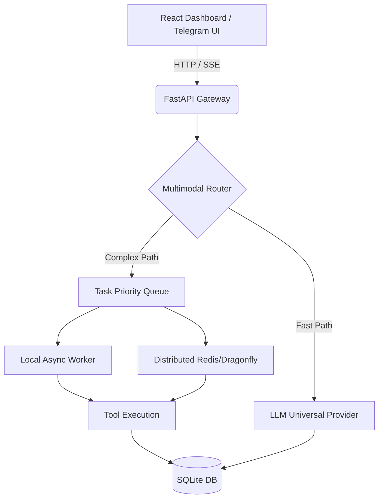

# DreamAgent v10 🚀

> **Autonomous Multi-Model AI Agent Platform** — Universal webhook routing, multi-tier queue tasks, real-time SSE streaming, and local privacy.

[](https://fastapi.tiangolo.com/)
[](https://vitejs.dev/)
[](https://sqlite.org/)

DreamAgent v10 is a production-hardened platform for autonomous AI agents. It intelligently routes conversational queries, executes heavy tasks via background worker queues, processes parallel multi-provider workflows, and provides a polished web interface for controlling everything from Telegram integrations to AI model keys.

---

## ⚡ Quick Start

### Step 1: Install Dependencies
```bash
# 1. Install Python dependencies
pip install -r requirements.txt

# 2. Install Frontend dependencies
cd "frontend of dreamAgent/DreamAgent-v10-UI"
npm install
```

### Step 2: Configure Environment
Copy `.env.example` to `.env` and fill in your keys (e.g. Gemini, Groq, OpenAI). 
*Note: DreamAgent supports a **Bootstrap Fallback Mechanism**! If your primary key hits a rate limit, the system gracefully cycles through your other `.env` providers to guarantee uptime.*

### Step 3: Run the Project
Launch both the backend and frontend simultaneously using the provided batch file:
```cmd
start.bat or ./start.bat
```
This will start:
- 🚀 **DreamAgent Server** on `http://localhost:8001`
- 🎨 **DreamAgent Dashboard** on `http://localhost:5000`

---

## 🛠 Project Toolkit

| Script | Purpose |
|---|---|
| `start.bat` | One-click launcher for the entire stack. |
| `clear_db.py` | Automatically sweeps and resets the local `dreamagent.db` SQLite state. |
| `telegram_bot.py` | Background runner for Telegram agent integrations. |
| `test_news_stream.py` | Local debugging suite for SSE generation and task routing. |

---

## 🏗 Architecture & Stack 



### Key Technical Pillars
1. **Universal LLM Provider**: Automatically interfaces with Anthropic, OpenAI, Meta, Gemini, Groq, or Local Ollama using a seamless interface.
2. **Hybrid Queues**: Uses lightweight `asyncio` queues in Windows environments, automatically upgrading to Redis/Dragonfly in high-load distributed deployments.
3. **Optimistic UI / Real-time Sync**: The React UI uses Server-Sent Events (SSE) combined with continuous database synchronization to ensure chat histories never flicker or ghost.

---

## 🔑 Key Features
* **Universal Telegram/Discord Integration**: Central webhook endpoints and local polling integrations via the UI.
* **Persistent Memory**: Your agents retain user preferences across runs and restarts.
* **Advanced Monitoring**: A fully-fledged GUI dashboard tracks total tokens, running tasks, worker failures, and agent health (`/api/v1/stats`).
* **Zero Hardcoding**: 100% portable repository structure.

---

## ⚠️ Security Notice

**Never commit your `.env` or `.db` files!**
This repo is configured with a strict `.gitignore`. If you are uploading this to GitHub, always use terminal Git `git push` or GitHub Desktop instead of the browser's drag-and-drop feature to ensure your secrets remain on your hard drive.

---

## 🔌 Integrations

### ✅ Supabase (Auth + Database + Storage)
Connected. Keys stored in `.env`:

```env
SUPABASE_URL=https://your-project.supabase.co
SUPABASE_ANON_KEY=sb_publishable_...
SUPABASE_SERVICE_KEY=       # add your service-role key for admin ops
```

**Usage in DreamAgent:**
```python
from integrations.supabase_client import get_supabase
sb = get_supabase()

# Auth
sb.sign_up("user@example.com", "password")
sb.sign_in("user@example.com", "password")

# Database
sb.select("agents", filters={"user_id": "abc123"})
sb.insert("agents", {"name": "MyAgent", "user_id": "abc123"})

# Storage
sb.upload_file("uploads", "file.pdf", file_bytes)
```

**Builder Integration:**  
When you build a project via the Builder and include connection `"supabase"`, the output folder automatically contains:
- `supabase.js` — frontend ES Module client with auth helpers
- `backend/supabase_backend.py` — FastAPI-ready Python client

---

### ✅ Tavily (AI-Powered Web Search)
Connected. Key stored in `.env`:

```env
TAVILY_API_KEY=tvly-dev-...
```

**Usage in DreamAgent:**
```python
from integrations.tavily_client import get_tavily
tv = get_tavily()

results = tv.search("latest AI news", max_results=5)
print(results["answer"])
print(results["results"])

news = tv.search_news("OpenAI GPT-5")
research = tv.deep_research("quantum computing breakthroughs")
```

**Builder Integration:**  
Including connection `"tavily"` in a builder request injects `backend/tavily_search.py` with ready-to-use `web_search()` and `news_search()` functions.

---

### 🔲 Stripe (Payments & Subscriptions)
**Status:** Partially configured — SDK ready, keys needed.

To activate Stripe, complete these steps:

#### Step 1: Get your Stripe keys
1. Go to [https://dashboard.stripe.com/apikeys](https://dashboard.stripe.com/apikeys)
2. Copy your **Secret key** (`sk_live_...` or `sk_test_...`)
3. Copy your **Publishable key** (`pk_live_...` or `pk_test_...`)

#### Step 2: Add to `.env`
```env
STRIPE_API_KEY=sk_test_your_secret_key_here
STRIPE_PUBLISHABLE_KEY=pk_test_your_publishable_key_here
STRIPE_WEBHOOK_SECRET_BUILDER=whsec_your_webhook_secret
```

#### Step 3: Install Stripe SDK
```bash
pip install stripe
```

#### Step 4: Test
```bash
python test_integrations.py
```

**Builder Integration:**  
Including `"stripe"` as a connection in a Builder request injects:
- `backend/stripe_payments.py` — checkout session + webhook verification
- `stripe-client.js` — frontend payment button logic

---

## 🚧 Manual Setup Required

The following features are **not yet auto-implemented** due to requiring external accounts, third-party APIs, or custom backend logic. Instructions for each are below:

---

### 💬 Chat Support (Live Chat Widget)

**Recommended service:** [Crisp](https://crisp.chat), [Tawk.to](https://tawk.to), or [Intercom](https://intercom.com)

**To add Crisp (free) to your generated apps:**
1. Sign up at [https://crisp.chat/en/signup/](https://crisp.chat/en/signup/)
2. Get your Website ID from the Crisp dashboard
3. Add this snippet to your app's `index.html` before `</body>`:
```html
<script type="text/javascript">
  window.$crisp=[];
  window.CRISP_WEBSITE_ID="YOUR_WEBSITE_ID";
  (function(){var d=document; var s=d.createElement("script");
  s.src="https://client.crisp.chat/l.js"; s.async=1; d.getElementsByTagName("head")[0].appendChild(s);})();
</script>
```
4. Add env key: `CRISP_WEBSITE_ID=your_id`

---

### 📊 Analytics API

**Recommended service:** [PostHog](https://posthog.com) (open-source, self-hostable)

**To add PostHog analytics:**
1. Sign up at [https://us.posthog.com/signup](https://us.posthog.com/signup)
2. Get your **Project API Key**
3. Add to `.env`: `POSTHOG_API_KEY=phc_your_key_here`
4. Install: `pip install posthog`
5. Track events in Python:
```python
import posthog
posthog.api_key = os.getenv("POSTHOG_API_KEY")
posthog.capture("user_id", "builder_session_started", {"type": "ecommerce"})
```
6. Add to frontend HTML:
```html
<script>
  !function(t,e){var o,n,...}(window,document,'posthog','https://us.i.posthog.com',{api_host:'https://us.i.posthog.com',person_profiles:'identified_only'});
  posthog.init('YOUR_CLIENT_KEY')
</script>
```

---

### 🔔 Notifications (Push / Email)

**Option A — Email Notifications via Resend:**
1. Sign up at [https://resend.com](https://resend.com)
2. Get your API Key
3. Set `.env`: `RESEND_API_KEY=re_your_key`
4. Install: `pip install resend`
5. Send email:
```python
import resend, os
resend.api_key = os.getenv("RESEND_API_KEY")
resend.Emails.send({
    "from": "DreamAgent <noreply@yourdomain.com>",
    "to": "user@example.com",
    "subject": "Build Complete 🚀",
    "html": "<p>Your project is ready!</p>"
})
```

**Option B — Push Notifications via OneSignal:**
1. Create account at [https://onesignal.com](https://onesignal.com)
2. Create a new Web Push app and get your App ID + REST API key
3. Set `.env`: `ONESIGNAL_APP_ID=... ONESIGNAL_API_KEY=...`
4. Add OneSignal SDK to your frontend and call `OneSignal.init({appId: "..."})`

---

### 🔐 Login / Auth (Full Auth System)

Supabase Auth is already wired up (above). To add a login page to generated projects:

1. Create a `login.html` in your project with the Supabase JS client.
2. Call `supabase.auth.signInWithPassword()` on form submit.
3. Protect routes by checking `supabase.auth.getUser()` on page load.
4. For OAuth (Google, GitHub, etc.):
   - Go to Supabase Dashboard → Auth → Providers
   - Enable the provider and add redirect URL: `http://localhost:8001/api/oauth/supabase/callback`
   - Call: `supabase.auth.signInWithOAuth({ provider: 'google' })`

---

### 🛡️ Admin Panel

**Option A — Use the built-in DreamAgent Dashboard**
The Builder already generates admin dashboards when you select type `dashboard`.
Ask DreamAgent: _"Build me an admin dashboard with user management"_

**Option B — Supabase Studio (instant admin)**
Supabase provides a built-in table editor and admin panel at:
```
https://supabase.com/dashboard/project/YOUR_PROJECT_ID
```

**Option C — Build custom with FastAPI + React**
1. Create a protected `/admin` route in FastAPI requiring `service_role` JWT
2. Build a React admin table consuming `/api/admin/users`, `/api/admin/usage`
3. Tell DreamAgent: _"Build an admin panel with user and session management using Supabase"_

---

## 🧪 Run Integration Tests

```bash
python test_integrations.py
```

Expected output (with valid keys):
```
✅ PASS  Supabase connection  — connected
✅ PASS  Tavily search        — returned 1 results
⚠️  SKIP  Stripe              — STRIPE_API_KEY not set in .env
```

---

## 📦 New Files Added

| File | Purpose |
|---|---|
| `integrations/__init__.py` | Package entry point |
| `integrations/supabase_client.py` | Supabase auth + DB + storage wrapper |
| `integrations/tavily_client.py` | Tavily web/news/finance search wrapper |
| `integrations/stripe_client.py` | Stripe checkout + subscriptions + webhooks |
| `backend/builder/connections.py` | Updated with Supabase, Tavily, Stripe scaffolding |
| `test_integrations.py` | One-command connectivity test for all APIs |

